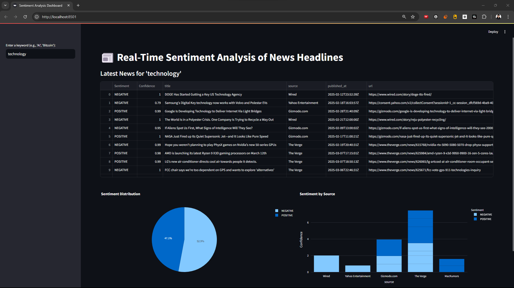

# Real-Time Sentiment Analysis Dashboard

  
([video_demo](https://drive.google.com/file/d/10gvzkR7efoUYUQApo6h8SvT32Nmz1yRQ/view?usp=sharing))

Analyzes sentiment of news headlines using **Hugging Face NLP** and **Streamlit**.  
Deployed live: [Sentiment-Dash](https://sentiment-dash.streamlit.app/)

## Features
- Real-time news sentiment scoring
- Interactive charts (Plotly)
- Easy keyword search (e.g., "AI", "Bitcoin")

## Tech Stack
- **Python**  (Backend)
- **Streamlit** (Frontend)  
- **Hugging Face Transformers** (NLP Model)  
- **News API** (Data Source)

## Installation
1. Clone repo:
   ```bash
   git clone https://github.com/apemod3/sentiment-dashboard.git
